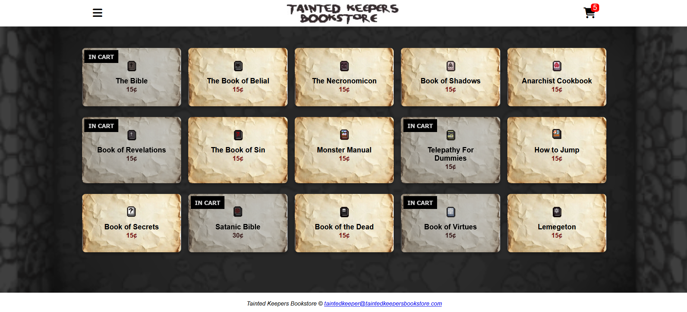
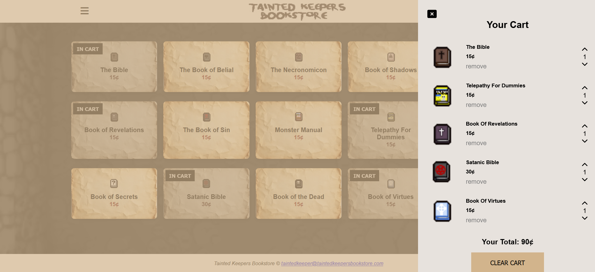

# Tainted Keepers Bookstore
Single-page React app displaying a list of books from a JSON file.  Users can add items to a cart, adjust quantities, and view the total.  Cart state is saved in localStorage.

## Live Demo

Play the project here:  
**https://ian-swartz.github.io/Tainted-Keepers-Bookstore/**

---

## Screenshots

### Home Page


### Cart Overlay


---

## Project Overview

**Tainted Keepers Bookstore** is a responsive frontend single-page application built to explore JSON-driven state parsing, browser cache mechanisms, and fluid component interaction patterns. By transforming a standard e-commerce UI pattern into a themed catalog based on item mechanics from *The Binding of Isaac*, the project implements strict data separation where the entire item layout, pricing strategy, item pools, and algorithmic descriptors are parsed dynamically at runtime.

### Key Objectives:
* **Decoupled State Management:** Rendering complex nested JSON structures cleanly using single-directional data flows in React.
* **Persistent Web Storage:** Integrating lifecycle tracking hook syncs to serialize and reconstruct user session state automatically across page reloads.
* **Asynchronous Content Pipeline:** Reading and parsing local resource trees dynamically using local browser fetch pipelines optimized for non-blocking UI delivery.

---

## Core Features

* **Dynamic Data Fetching:** Implements asynchronous lifecycle loaders to parse and map catalog blocks, with resilient fallback protocols to parse distinct root data configurations effortlessly.
* **Persistent Cart Management:** Leverages browser `localStorage` handling to automatically track item arrays, specific counts, and current accumulation amounts across multiple user sessions.
* **Contextual Catalog Parsing:** Leverages a strictly structured database containing specific item identification tags, game source indicators, item qualities, pool listings, and strategic descriptions.
* **Interactive Cart Controls:** Offers intuitive interactive sliding or overlay panels with real-time incremental count modifications, real-time aggregate price updating, and quick item removals.

---

## Tech Stack

- **React.js** (Functional Components, JSX, & Hooks)
- **Vite** (Next-Generation Frontend Tooling & Production Bundling)
- **CSS3** (Transform-3D Profiles, Flexbox, & Grid Layouts)
- **JavaScript** (State Mapping & Matrix Array Algorithms)

---

## Project Structure
```
├── .github
│   └── workflows
│       └── deploy.yml
├── public
│   ├── images
│   │   ├── screenshots
│   │   │   ├── cart.png
│   │   │   └── home.png
│   │   ├── book1.jpg
│   │   ├── book10.jpg
│   │   ├── book11.jpg
│   │   ├── book12.jpg
│   │   ├── book13.jpg
│   │   ├── book14.jpg
│   │   ├── book15.jpg
│   │   ├── book2.jpg
│   │   ├── book3.jpg
│   │   ├── book4.jpg
│   │   ├── book5.jpg
│   │   ├── book6.jpg
│   │   ├── book7.jpg
│   │   ├── book8.jpg
│   │   ├── book9.jpg
│   │   ├── logo.jpg
│   │   ├── note.jpg
│   │   └── sheol.jpg
│   └── library_item_names.json
├── src
│   ├── components
│   │   ├── Cart.jsx
│   │   ├── CartItem.jsx
│   │   ├── Navbar.jsx
│   │   ├── ProductCard.jsx
│   │   └── ProductsList.jsx
│   ├── App.jsx
│   ├── index.jsx
│   └── styles.css
├── index.html
├── LICENSE
├── package.json
├── README.md
├── README(project).txt
└── vite.config.js
```

---

## Production Deployment & Workflow

The architecture utilizes an automated deployment ecosystem via a custom **GitHub Actions pipeline** optimized for modular bundlers:
1.  **Vite Assembly:** On push routines targeting the production branch, compilation sequences parse JSX syntax directly to render structural tree outputs mapped inside a root distribution matrix (`/dist`).
2.  **Relative Pathing Optimization:** Explicit `base: './'` overrides are enforced across configuration levels to secure problem-free hosting inside GitHub subdirectories without root-path domain confusion.
3.  **Automated Continuous Delivery:** Automated runtime engines trigger dynamic dependency verification setups (`npm install --no-audit`) before systematically writing verified build packages straight to the GitHub hosting servers.

---

## Author

Developed by: Ian Swartz 

GitHub: https://github.com/ian-swartz

---

Project Created for Millersville CMSC 498 - Independent Study (Web/Game Development)

Original CodeSandbox Share Link: **https://codesandbox.io/p/sandbox/friendly-hill-9kgxvn**

CodeSandbox Website Link: **https://9kgxvn.csb.app/**

(CodeSandbox doesn't always load all the images, which I believe may be a server issue).

